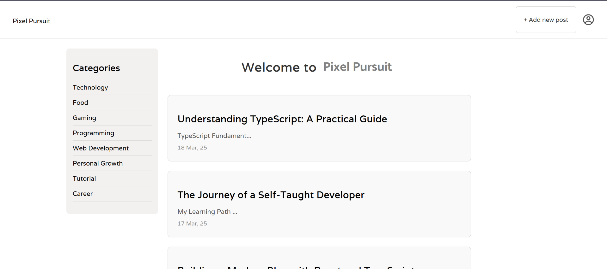

# Pixel Pursuit



A modern, minimalist blogging platform built with React, TypeScript, and Redux. Pixel Pursuit offers a clean, intuitive interface for creating and sharing blog posts with rich text editing capabilities.

## 🌟 Features

- **Rich Text Editor**: Create beautiful posts with a powerful WYSIWYG editor
- **Image Support**: Upload and manage images within your posts
- **Category Management**: Organize posts with customizable categories
- **Responsive Design**: Seamless experience across all devices
- **User Authentication**: Secure user accounts and post management
- **Dynamic Table of Contents**: Automatically generated for each post
- **Modern UI/UX**: Clean, minimalist design with smooth transitions

## 🛠️ Tech Stack

- **Frontend**:

  - React
  - TypeScript
  - Redux (State Management)
  - SCSS (Styling)
  - React Router (Navigation)

- **Key Libraries**:
  - React Quill (Rich Text Editing)
  - React Icons
  - Redux Thunk (Async Actions)

## 🎯 Core Functionality

- **Post Management**:

  - Create, edit, and delete posts
  - Rich text formatting
  - Image uploads
  - Category tagging

- **User Features**:

  - User authentication
  - Profile management
  - Personalized post management

- **UI/UX**:
  - Responsive navbar with mobile menu
  - Dynamic table of contents
  - Category filtering
  - Infinite scroll for posts

## 🖼️ Screenshots

## 📝 Project Structure

```
src/
├── components/     # React components
├── redux/         # Redux state management
│   ├── actions/   # Action creators
│   ├── reducers/  # State reducers
│   └── store.ts   # Redux store configuration
├── types/         # TypeScript type definitions
├── styles/        # SCSS styles
└── utils/         # Utility functions
```

## 🎨 Design Choices

- **Minimalist UI**: Clean, distraction-free interface focusing on content
- **Typography**: Carefully selected fonts for optimal readability
- **Responsive Design**: Mobile-first approach ensuring compatibility across devices
- **Color Scheme**: Subtle, professional palette enhancing readability

## 📄 License

This project is licensed under the MIT License - see the [LICENSE](LICENSE) file for details.

## 👤 Author

Your Name

- GitHub: [@akashramesh13](https://github.com/akashramesh13)
- Portfolio: [akashramesh.in](https://www.akashramesh.in)

---

_Built with ❤️ using React and TypeScript_
